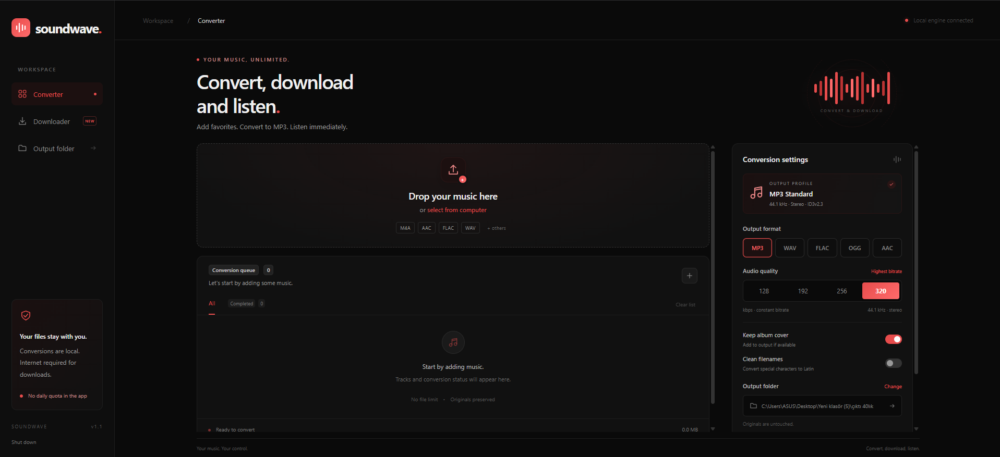

# SoundWave

<p align="center">
  
</p>

**Your media, anywhere.** A fast, local-first audio converter and YouTube downloader.


## What is SoundWave?

SoundWave is a local-first web application with a local file **Converter** and a **YouTube Downloader**. The server listens only on `127.0.0.1`, and local source files are processed on your computer instead of being uploaded to a cloud service.

### Converter

- Reads **MP3, M4A, AAC, WAV, FLAC, OGG, Opus, WMA, AIFF, ALAC, M4B, MP4, WebM, MOV, MKV, and MKA**
- Outputs **MP3, M4A (AAC), FLAC, WAV, Opus, or OGG Vorbis**
- Preserves ID3 metadata and album art for MP3 output
- Provides codec-specific bitrate, quality, compression, and bit-depth controls
- Supports drag and drop, queue management, and 1, 2, or 4 parallel jobs

### YouTube Downloader

- Inspects videos, Shorts, and playlists
- Produces MP3 audio or MP4 video (H.264/AAC with `faststart`)
- Shows live progress, speed, and ETA
- Continues interrupted downloads through partial files

Only download content that you own or have permission to use.

### Privacy and security

- Local-only HTTP server on `127.0.0.1`
- Per-session CSRF tokens and browser security headers
- Strict YouTube URL validation and no shell command interpolation
- Configurable upload-size and request-time limits
- Verified SHA-256 download for the official yt-dlp binary
- No cookies, browser credentials, or DRM handling

## Supported platforms

| Platform | Supported setup |
|---|---|
| Windows 10/11 | Bundled launcher; verified FFmpeg and yt-dlp installation |
| macOS 10.15+ | Intel and Apple Silicon; Homebrew is used for FFmpeg |
| Linux | x64 and ARM64, glibc or musl; common package managers are supported |

Node.js 22 or later is required on every platform.

## Quick start

```bash
git clone https://github.com/4ilteris7/SoundWave.git
cd SoundWave
npm ci
npm run setup
npm start
```

Open `http://127.0.0.1:47831` if the browser does not open automatically.

### Platform launchers

Windows users can double-click:

```text
Start.cmd
```

macOS and Linux users can run:

```bash
chmod +x Start.sh Update-YouTube-Engine.sh scripts/install-engine.sh
./Start.sh
```

`npm run setup` performs the same dependency check without starting the application:

- On Windows, FFmpeg is downloaded from the configured Gyan build and checked with its published SHA-256 file.
- On macOS, an existing FFmpeg installation is used; otherwise Homebrew installs it.
- On Linux, an existing installation is used; otherwise `apt`, `dnf`, `pacman`, `zypper`, or `apk` installs it. Administrator access may be requested by the package manager.
- yt-dlp is downloaded from the official release for the current operating system, CPU architecture, and Linux libc, then checked against the official `SHA2-256SUMS` file.

SoundWave first checks the environment-variable path, then a binary under `tools/`, and finally the system `PATH`.

## Usage

### Convert local files

1. Drop files onto the interface or choose them with the file picker.
2. Select the output format and its quality setting.
3. Choose the output folder and parallel-job count if needed.
4. Start conversion, then preview or open the completed output.

### Download from YouTube

1. Open **Downloader** in the sidebar.
2. Paste a video, Short, or playlist URL.
3. Inspect the link and select the wanted entries.
4. Choose MP3 or MP4 and start the queue.

The Linux folder picker uses Zenity or KDialog when available. Without either tool, SoundWave continues to use the configured output folder; it can also be set with `SOUNDWAVE_OUTPUT`.

## Tool updates

Update the local yt-dlp binary from the interface or run:

```bash
npm run update:youtube
```

The update is downloaded atomically and replaces the previous binary only after its SHA-256 checksum has been verified.

## Testing

```bash
npm ci
npm test
```

Tests use real FFmpeg to validate MP3, M4A/AAC, FLAC, 24-bit WAV, Opus, OGG, metadata, cover art, cancellation, output collisions, and WebM-to-H.264/AAC MP4 conversion. Platform-specific behavior is tested with injected Windows, macOS, and Linux environments. GitHub Actions runs the suite on all three operating systems.

## Environment variables

| Variable | Description | Default |
|---|---|---|
| `FFMPEG_PATH` | FFmpeg executable path or command | bundled binary, then `ffmpeg` on `PATH` |
| `FFPROBE_PATH` | FFprobe executable path or command | bundled binary, then `ffprobe` on `PATH` |
| `YTDLP_PATH` | yt-dlp executable path or command | bundled binary, then `yt-dlp` on `PATH` |
| `PORT` | Local server port | `47831` |
| `SOUNDWAVE_DATA` | Data and session directory | `data/` |
| `SOUNDWAVE_OUTPUT` | Default output directory | `outputs/` |
| `SOUNDWAVE_MAX_UPLOAD_BYTES` | Maximum size of one local upload | `4294967296` (4 GiB) |
| `SOUNDWAVE_REQUEST_TIMEOUT_MS` | Maximum HTTP request duration | `1800000` (30 min) |

## Project structure

```text
soundwave/
|-- .github/workflows/test.yml      # Windows, macOS, and Linux CI
|-- lib/
|   |-- audio.mjs                   # Format and FFmpeg arguments
|   |-- platform.mjs                # Cross-platform paths and desktop integration
|   |-- process.mjs                 # Process runner and process-tree cancellation
|   `-- youtube.mjs                 # YouTube inspection, download, and queue manager
|-- public/                         # Browser interface
|-- scripts/
|   |-- install-engine.ps1          # Verified Windows FFmpeg installer
|   |-- install-engine.sh           # macOS/Linux FFmpeg setup
|   |-- install-youtube.mjs         # Verified cross-platform yt-dlp installer
|   |-- setup.mjs                   # Cross-platform dependency setup
|   `-- select-folder.ps1           # Windows folder picker
|-- tests/                          # Unit, interface, and real FFmpeg tests
|-- Start.cmd                       # Windows launcher
|-- Start.sh                        # macOS/Linux launcher
`-- server.mjs                      # Local HTTP server and API
```

## Engine licenses

- **FFmpeg / FFprobe:** [FFmpeg](https://ffmpeg.org/) and platform package/build providers. The Windows installer uses [Gyan builds](https://www.gyan.dev/ffmpeg/builds/).
- **yt-dlp:** [yt-dlp](https://github.com/yt-dlp/yt-dlp), downloaded from its official GitHub releases.

The engine binaries are not committed to this repository. If you redistribute SoundWave with them, comply with their respective license terms.

## License

SoundWave is licensed under the [Apache License 2.0](LICENSE).
